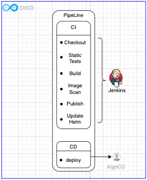
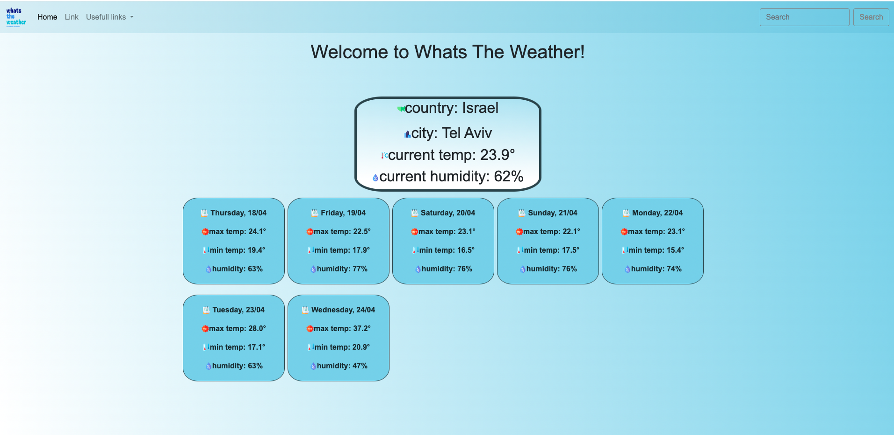

# Features

- [CI/CD-Jenkins](./CodePipeline)
- [SourceCode](./weather_app)

## CodePipeline

**important**

this Jenkins [buildspec](./Jenkinsfile) will pull a project from this github repository, Run static tests by the use of SonarCloud and build a new version of the application, Then Scan the built image via Snyk and deliver the image to Docker-Hub and update the helm chart of targeted helm charts at the end to trigger ArgoCD to update the pods to the new version of the application.

## SourceCode

this source code contains a simple web weather application that allows users to send API requests to receive data for the weather in the next 7 days, along with the application a [DockerFile](./weather_app/Python-Project/Dockerfile) is included to build an image of the application for deployment purposes.

